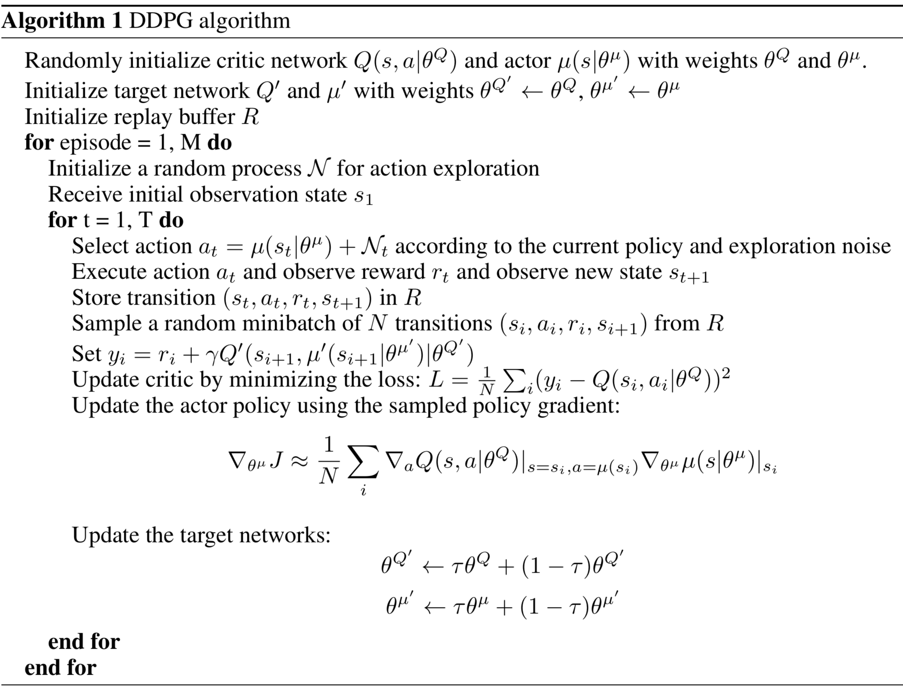

# Continuous Control with Reinforcement Learning
In this directory the solution to the Cartpole Upswing problem is given.
The structure is the following:
* [ddpg_upswing.py](ddpg_upswing.py) is the main for training the agent
* [My_Environments](My_Environments) includes the registration and the modified cartpole environment from OpenAI Gym
* [src](src) contains all components for the DDPG algorithm:
    - [Agents](src/agents.py): provides the agents for continuous control in a reinforcement learning environment:
        + random agent, which performs only uniform distributed actions
        + DDPG agent, that follows the learned policy with an exploration noise
    - [Environment](src/environment.py): creates the modified cartpole environment and let the agents act within the environment
    - [Memory](src/memory.py): is the shared experience replay buffer of the agents
    - [Networks](src/networks.py): containing the actor and the critic neural network architecture
    - [Layers](src/layers.py): wrapper functions to create the neural networks more easily
    - [Exploration Noise](src/explorationnoise.py): Generating policy functions and action noise to let the agent explore the environment
    - [Utilities](src/utils.py): defines the lazy property function to ensure that the tensorflow objects are only added once to the graph
* [requirements.txt](requirements.txt): [pipreqs](https://github.com/bndr/pipreqs) generated file to install all necessary python libraries

## Learning Algorithm
The DDPG algorithm was published by DeepMind (Lillicrap et al.) "[Continuous Control with Deep Reinforcement Learning](https://arxiv.org/pdf/1509.02971.pdf)" and uses two seperate neural networks. The first neural network (actor network) predicts the action of the agent and the second neural network (critic network) looks at the action and the new state and predicts the quality (Q-value). In order to establish stability during training, an experience replay buffer was introduced, which adds each observation from the agent to the memory. This serves to ensure that the examples used for training do not correlate with each other. Since DDPG is an off-policy algorithm, an exploration noise is given on each action. This assures that the agent explores the learning environment sufficiently. No regularization techniques were used which showed empirically better results.

## Network Architecture
### Actor
The network architecture for the actor is structured as follows:
* Input Layer:
    - Input: State of the Agent
    - Output: State of the Agent
    - Activation Function: None
    - Weight Initialization: None
* First Hidden Layer:
    - Input: Output of the Input Layer
    - Output: 400 Neurons
    - Activation Function: ReLU
    - Weight Initialization: Variance Scaling (FAN-IN)
* Second Hidden Layer:
    - Input: Output of the First Hidden Layer
    - Output: 300 Neurons
    - Activation Function: ReLU
    - Weight Initialization: Variance Scaling (FAN-IN)
* Output Layer:
    - Input: Output of the Second Hidden Layer
    - Output: 1
    - Activation Function: tanh (tangens hyperbolic)
    - Weight Initialization: Uniform Distributed from -0.003 to 0.003

### Critic
The network architecture for the critic is structured as follows:
* Input Layer:
    - Input: State of the Agent
    - Output: State of the Agent
    - Activation Function: None
    - Weight Initialization: None
* First Hidden Layer:
    - Input: Output of the Input Layer
    - Output: 400 Neurons
    - Activation Function: ReLU
    - Weight Initialization: Variance Scaling (FAN-IN)
* Second Hidden Layer:
    - Input: Output of the First Hidden Layer & Action
    - Output: 300 Neurons
    - Activation Function: ReLU
    - Weight Initialization: Variance Scaling (FAN-IN)
* Output Layer:
    - Input: Output of the Second Hidden Layer
    - Output: 1
    - Activation Function: Linear
    - Weight Initialization: Uniform Distributed from -0.003 to 0.003 (can be also Variance Scaling FAN-IN)

### Target & Online Networks
For the learning process it is necessary to know the temporal difference error (TD-Error) between true and predicted Q-value (output of the critic). However, since it is not known what the true TD target is, it must be estimated and for this estimation the Bellman equation is used, which takes the reward of the action + the highest Q-value of the next state. If, however, the estimation of the Q-value changes during the training phase, only the optimal TD goal can be chased, but not achieved. To avoid this, two Actor and two Critic networks are set up. The first network of both is used for online prediction of the outputs, while the second network of both is used as the target network. This helps to ensure that the TD target does not fluctuate all the time but is available for the online networks for a certain period of time.
There are two ways to update the target networks:
* Hard-Update: All weights from the target network will be assigned identically with the weights from the online network
* Soft-Update: A fraction of the weights from the online network will be added to the weights from the target network
